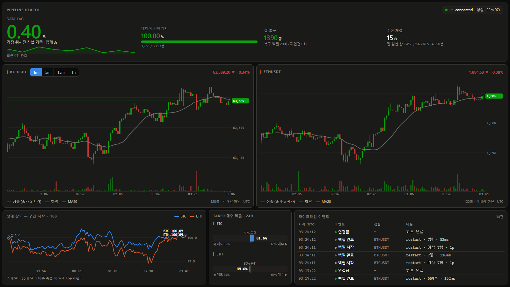

# binance-ops-dashboard

Binance 실시간 거래 데이터 수집 파이프라인과 운영 대시보드.

BTCUSDT · ETHUSDT 의 시세를 WebSocket 으로 상시 수집하고, 어떤 이유로든 데이터에 구멍이 생기면
**스스로 감지해 REST 로 메우는** 파이프라인입니다. 대시보드는 시장 지표와 함께
**파이프라인 자체의 건강 상태**를 보여줍니다.

> 이 프로젝트는 Binance 의 공개 API 를 사용하는 비공식 프로젝트이며, Binance 와 아무런 관련이 없습니다.



```bash
cp .env.example .env && docker compose up     # → http://localhost:3000
```

| 문서 | 내용 |
|---|---|
| [docs/ARCHITECTURE.md](docs/ARCHITECTURE.md) | 구조 설계와 장애 시나리오 — **왜 그렇게 만들었는가** |
| [docs/METRICS.md](docs/METRICS.md) | 지표 선정 근거와 형태·색 선택 |
| [docs/AI-USAGE.md](docs/AI-USAGE.md) | AI 활용 방식 — 무엇을 맡기고 무엇을 직접 판단했는가 |

---

## 핵심 아이디어

시스템이 다루는 문제는 결국 하나입니다 — **데이터에 구멍이 생기는 순간들.**
최초 실행 시(과거 데이터가 없음), 서버가 죽었다 살아났을 때, 네트워크가 잠깐 끊겼을 때.

이 셋은 사실 같은 문제입니다. *"내가 가진 마지막 봉이 언제인가"*를 묻고 거기서부터 채우면 됩니다.

```ts
const last = await db.maxOpenTime(symbol, '1m')

const from = last ?? (now - BACKFILL_DAYS * DAY)
//           ↑ 이 한 줄이 "최초 백필"과 "재시작 갭 백필"을 가릅니다

await ensureRange(symbol, '1m', from, now)
connectWebSocket()
```

같은 함수가 네 가지 상황을 처리합니다.

| 상황 | from | to | 호출 주체 |
|---|---|---|---|
| 최초 실행 | `now - 7d` | `now` | 부팅 시퀀스 |
| 서버 재시작 | DB 마지막 봉 | `now` | 부팅 시퀀스 |
| WS 재연결 직후 | 끊긴 시각 | `now` | 재연결 핸들러 |
| 중간 구멍 발견 | 구멍 시작 | 구멍 끝 | 무결성 스캐너 |

이것이 성립하는 이유는 **멱등성**입니다. `(symbol, interval, open_time)` 을 기본키로 두고
`ON CONFLICT DO UPDATE` 로 쓰기 때문에, 같은 구간을 몇 번 다시 긁어도 안전합니다.
그래서 구간을 일부러 겹치게 잡아도 됩니다.

---

## 시스템 구조

```
   Binance                  ┌─────────────┐
   ├─ WebSocket  ──실시간──▶ │             │
   └─ REST API   ──백필───▶ │  collector  │ ──▶ ┌──────────┐
                            │   (워커)     │     │ Postgres │
                            └─────────────┘     └────┬─────┘
                                                     │ LISTEN/NOTIFY
                                              ┌──────▼──────┐
                                    브라우저 ◀─│   Next.js   │
                                        SSE   │   (웹)      │
                                              └─────────────┘
```

수집기와 웹 서버는 **별도 프로세스**입니다. 생명주기가 다르기 때문입니다 —
웹은 배포마다 재시작되고 트래픽에 따라 복제되지만, 수집기는 무중단으로 살아 있어야 하고
복제되면 중복 수집이 발생합니다. 합쳐두면 *대시보드 CSS 한 줄 수정이 데이터에 구멍을 냅니다.*

두 프로세스는 서로를 직접 호출하지 않습니다. Postgres 만이 유일한 접점입니다.

---

## 안정성 설계

| 장애 | 대응 |
|---|---|
| WS 연결 끊김 | 지수 백오프 재연결 (1s → 최대 30s, jitter) |
| Binance 24h 강제 종료 | 위 재연결 로직이 동일하게 흡수 |
| **좀비 연결** (끊김 미감지) | `lastMessageAt` watchdog — 10초 무소식이면 강제 재접속 |
| 재연결 동안의 누락 | 재연결 직후 갭 백필 자동 호출 |
| 원인 불명의 누락 | 무결성 스캐너가 주기적으로 연속성 검사 후 자가 치유 |
| REST rate limit | weight 카운터 + 응답 헤더 보정 + `Retry-After` 존중 |
| 프로세스 크래시 | `restart: unless-stopped` → 재시작 시 갭 백필 자동 수행 |
| DB 장애 | 버퍼를 두지 않음 — 원본이 Binance 에 있으므로 복구 후 백필로 해결 |

가장 위험한 장애는 WS 가 끊기는 것이 아니라 **끊긴 걸 모르는 것**입니다.
TCP 연결이 살아 있는데 데이터만 안 오면 `onclose` 가 호출되지 않아 재연결이 영영 발동하지 않고,
대시보드는 멀쩡한 얼굴로 몇 시간 전 값을 띄웁니다. watchdog 이 이 조용한 실패를 잡습니다.

---

## 실행 방법

### 요구사항
- Docker / Docker Compose
- (로컬 개발 시) Node.js 20 이상

### 한 줄 실행

```bash
cp .env.example .env    # 모든 값에 기본값이 있어 그대로 두어도 동작합니다
docker compose up
```

**대시보드 → http://localhost:3000**

네 가지가 순서대로 뜹니다.

| 순서 | 서비스 | 하는 일 |
|---|---|---|
| 1 | `postgres` | 데이터베이스 (healthy 가 될 때까지 다음 단계가 기다립니다) |
| 2 | `migrate` | 스키마 생성. 한 번 돌고 끝납니다 |
| 3 | `collector` | 과거 7일치를 백필한 뒤 실시간 수집을 시작합니다 |
| 4 | `web` | 대시보드 |

> **포트 3000 이 이미 쓰이고 있다면** `up` 이 포트 충돌로 실패합니다.
> `.env` 의 `WEB_PORT` 를 비어 있는 포트로 바꾸세요 (예: `WEB_PORT=3100`).
> Windows 에서는 Hyper-V 가 일부 구간을 예약해 3000 을 못 쓸 수 있습니다 —
> `netsh interface ipv4 show excludedportrange protocol=tcp` 로 확인할 수 있습니다.

### 자가 치유를 직접 확인하기

"재시작하면 갭을 백필한다"를 문장으로 두지 않고 돌려볼 수 있게 만들었습니다.

```bash
npm run demo:chaos              # 수집기를 3분간 중단했다 재개하고 복구를 검증합니다
npm run demo:chaos -- --kill    # SIGKILL 로 죽여 자동 재시작 경로를 확인합니다
```

중단 전후의 적재 현황, 백필이 메운 봉 수, 남은 구멍 수를 표로 출력하고
마지막에 PASS/FAIL 을 냅니다 (실패 시 종료 코드 1).

### 로컬 개발

```bash
npm install
docker compose up postgres -d
npm run db:migrate
npm run dev:collector
npm run dev:web
```

테스트는 [실동작 검증](#실동작-검증) 절에 있습니다.

---

## 환경변수

전체 목록과 설명은 [`.env.example`](.env.example) 에 있습니다. 자주 건드리는 값만 옮기면:

| 변수 | 기본값 | 설명 |
|---|---|---|
| `SYMBOLS` | `BTCUSDT,ETHUSDT` | 수집 대상. 늘려도 코드 변경 불필요 |
| `BACKFILL_DAYS` | `7` | 최초 실행 시 거슬러 올라갈 기간 |
| `STALE_THRESHOLD_MS` | `10000` | 좀비 연결 판정 임계 |
| `INTEGRITY_SCAN_INTERVAL_MS` | `60000` | 무결성 스캐너 주기 |

---

## 기술 스택

| 레이어 | 선택 |
|---|---|
| 언어 | TypeScript |
| 수집기 | Node.js 독립 워커 |
| 웹 | Next.js (App Router) + React |
| DB | PostgreSQL 16 |
| ORM | Drizzle ORM |
| 실시간 전송 | Postgres `LISTEN/NOTIFY` → SSE |
| 실행 | Docker Compose |

---

## 프로젝트 구조

```
├─ apps/
│  ├─ collector/          # WS 수집 · 백필 · 무결성 스캐너
│  └─ web/                # 대시보드 · API · SSE
├─ packages/
│  ├─ db/                 # Drizzle 스키마 (양쪽 공유)
│  └─ shared/             # 타입 · 설정 · Binance 클라이언트 · 백필 계획
└─ docker-compose.yml
```

---

## 실동작 검증

설계가 의도대로 동작하는지 실제 Binance 연결로 확인한 내용입니다.
전부 `npm run demo:chaos` 로 재현할 수 있습니다.

| 시나리오 | 결과 |
|---|---|
| 최초 실행 | `reason=initial` → 심볼당 1,441봉 백필 후 WS 연결 |
| 수집기 3분 중단 후 재개 | `reason=restart` → 갭 감지, 심볼당 3봉 복구, **남은 구멍 0** |
| 연속성 검사 | `gap_count = 0` |
| 데이터 커버리지 | `100.00%` |
| `docker compose up` | postgres → migrate → collector + web 전 경로 동작 |

`source` 컬럼이 복구 과정을 데이터로 남깁니다.

```
13:14  ws    ← 죽기 전 실시간 수집
13:15  rest  ← 죽는 순간 미완성이던 봉을 백필이 확정본으로 덮음
13:16  rest  ┐
13:17  rest  ├ 죽어 있던 구간을 백필이 메움
13:18  rest  ┘
13:19  ws    ← 재시작 후 실시간 재개
```

### 테스트

```bash
npm test          # 118건 (단위 92 + 통합 26)
npm run typecheck
```

통합 테스트는 실제 Postgres 를 씁니다. DB 가 없으면 조용히 건너뛰므로
DB 없이 `npm test` 를 돌려도 단위 테스트는 통과합니다.

검증하는 것은 **이 시스템의 전제**입니다 — UPSERT 멱등성이 깨지면 `ensureRange` 통합
설계 전체가 무너지고, 지표 정의가 어긋나면 화면이 조용히 거짓말을 합니다.

---

## 라이브 데모 URL 을 두지 않은 이유

배포 URL 대신 **직접 재현**을 택했습니다. 판단 근거를 적습니다.

**1. 거래소가 데이터센터 IP 를 차단할 수 있습니다.** Binance 는 일부 리전의 클라우드
IP 를 막습니다. 리전을 잘못 고르면 수집이 아예 안 되고, 그러면 **죽은 파이프라인을
보여주는 대시보드**가 뜹니다. 이 프로젝트가 증명하려는 것의 정반대이고,
그건 데모가 없느니만 못합니다.

**2. 이 시스템은 24시간 상시 구동이 전제입니다.** 유휴 시 슬립하는 무료 호스팅에
올리면 수집기가 잠들고, 깨어날 때마다 갭이 생깁니다. 백필이 메우긴 하지만
**"끊기지 않고 모은다"는 주장 자체가 성립하지 않습니다.**

**3. 대신 재현 경로를 갖췄습니다.**

```bash
cp .env.example .env && docker compose up     # 전체 스택 기동
npm run demo:chaos                            # 죽였다 살려서 자가 치유 검증
```

라이브 URL 은 "지금 돌고 있다"만 보여줍니다. `demo:chaos` 는 **"죽여도 스스로
복구한다"를 보는 사람 손으로 확인시킵니다.** 이 과제가 요구한 것은 후자에 가깝습니다.

---

## 알려진 한계

정직하게 적습니다. 자세한 내용은 [ARCHITECTURE.md §13](docs/ARCHITECTURE.md).

- 수집기는 **단일 인스턴스 전제**입니다. 복제하면 중복 수집이 됩니다.
- `LISTEN/NOTIFY` 는 커넥션 유지가 필요해 **서버리스에서 동작하지 않습니다.**
- 웹 API 에 **인증이 없습니다.** 공개 시장 데이터만 읽는 단일 테넌트 전제입니다.
- 실제 Binance 연결 자체는 테스트하지 않습니다. 재연결·watchdog 은 가짜 소켓으로,
  진짜 네트워크 경로는 `demo:chaos` 로 나눠 확인합니다.

---

## 라이선스

MIT
